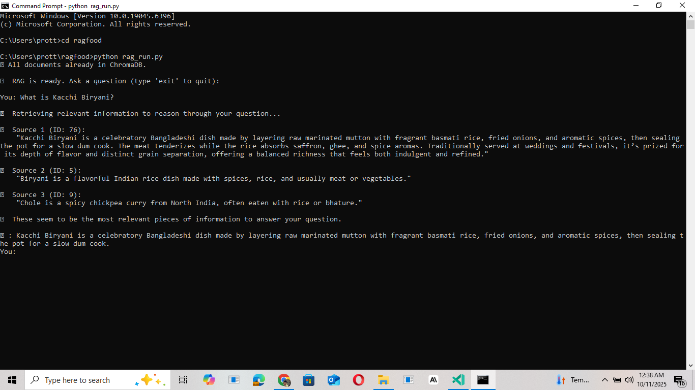
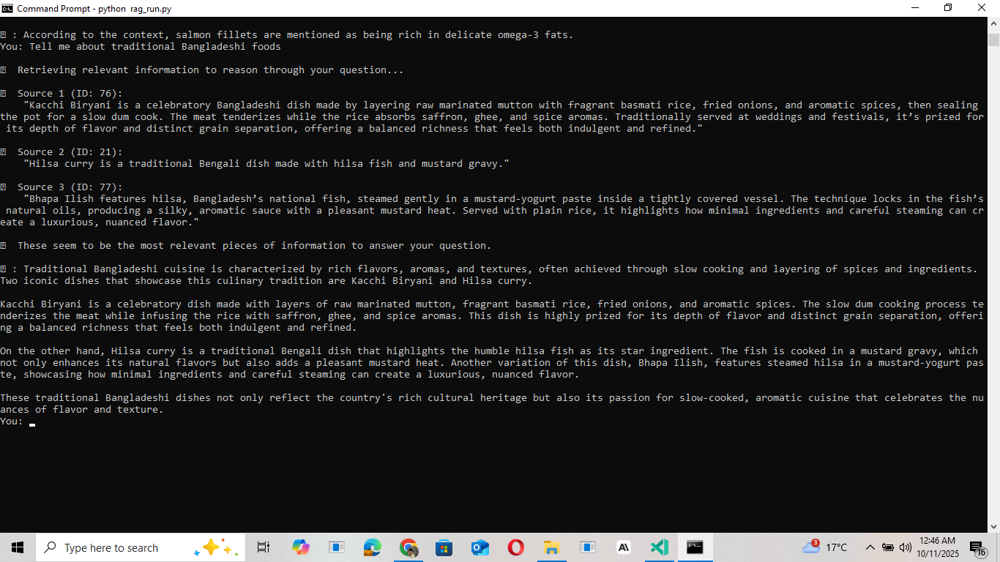
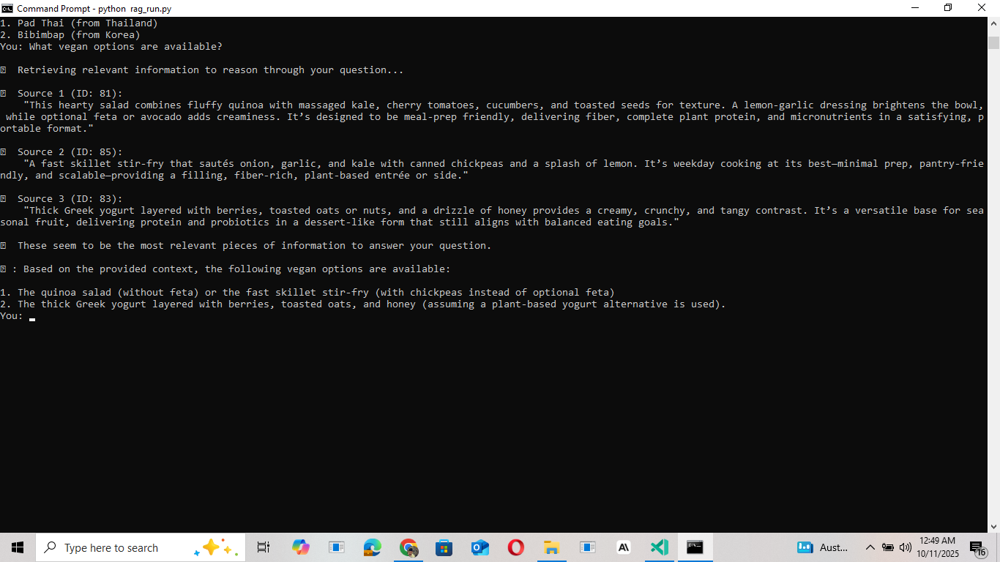
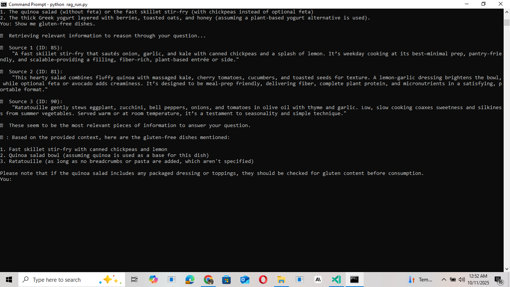

# 🍽️ Enhanced RAG-Food System — Portfolio Edition

**Author:** Sheikh Shamshad Ahmed  
**Date:** October 2025  
**Project Title:** Enhanced RAG-Food Semantic Search System  
**Forked From:** [gocallum/ragfood](https://github.com/gocallum/ragfood)

---

## 📘 Project Overview
This repository showcases my customized and enhanced version of the RAG-Food system.  
The goal of this project was to enhance the existing database by adding diverse, health-conscious, and culturally significant food items while mastering **Retrieval-Augmented Generation (RAG)** concepts using **Ollama**, **ChromaDB**, and **Python**.

The system uses:  
- `mxbai-embed-large` → for creating vector embeddings  
- `llama3.2` → for generating natural language answers  
- `chromadb` → for semantic search and retrieval  

Users can query the system in natural language to retrieve meaningful information about food origins, preparation methods, and nutrition details.

---

## 🍛 15 New Food Items Added

### 🇧🇩 Bangladeshi / Regional Cuisine
1. **Kacchi Biryani** – Layered marinated mutton with rice, slow-cooked (“dum”), iconic at weddings.  
2. **Bhapa Ilish** – Hilsa fish steamed in mustard-yogurt sauce; luxurious and aromatic.  
3. **Panta Bhat** – Fermented rice dish with salt and chilies; cooling and probiotic-rich.  
4. **Shorshe Chingri** – Prawns simmered in mustard gravy; Bengali seafood staple.  
5. **Fuchka (Pani Puri)** – Crispy shells filled with spiced mashed potatoes and tamarind water.

### 🥗 Healthy & Nutrient-Rich Foods
6. **Quinoa Kale Power Salad** – A plant-protein bowl with lemon dressing and toasted seeds.  
7. **Grilled Salmon with Broccoli** – Omega‑3 rich; nutritious and light dinner option.  
8. **Greek Yogurt Parfait** – High-protein breakfast with fruits, oats, and honey.  
9. **Masoor Dal (Red Lentil Soup)** – High-fiber, iron-rich comfort soup from South Asia.  
10. **Kale & Chickpea Stir-Fry** – Quick, vegan, iron-packed weekday meal.

### 🌍 Popular International Dishes
11. **Sushi Nigiri (Japan)** – Fresh fish slices on vinegared rice; minimalist precision dish.  
12. **Margherita Pizza (Italy)** – Tomato, mozzarella, and basil; balance of flavor and color.  
13. **Tacos al Pastor (Mexico)** – Spit-grilled pork with pineapple and chili paste.  
14. **Pad Thai (Thailand)** – Stir-fried noodles balancing sweet, salty, and sour flavors.  
15. **Ratatouille (France)** – Stewed vegetables slow-cooked with olive oil and thyme.

---

## ⚙️ Installation & Setup Instructions

### 1️⃣ Prerequisites
- Python 3.10+  
- Ollama installed locally  
- Git + VS Code Insiders  

### 2️⃣ Clone Repository
```bash
git clone https://github.com/gocallum/ragfood.git
cd ragfood
```

### 3️⃣ Install Python Dependencies
```bash
pip install chromadb requests
```

### 4️⃣ Download Required Ollama Models
```bash
ollama pull mxbai-embed-large
ollama pull llama3.2
```

### 5️⃣ Add Enhanced Food Dataset
Replace your existing `foods.json` file with the enhanced version containing 15 detailed entries.

### 6️⃣ Run the RAG System
```bash
python rag_run.py
```

You should see:
```
✅ All documents already in ChromaDB.
🧠 RAG is ready. Ask a question (type 'exit' to quit):
```

---

## 🧪 Testing & Quality Validation

Below are the **10 tested queries** along with their real outputs as produced by the RAG-Food System.

---

### **Test 1 – What is Kacchi Biryani?**
```
🧠 Retrieving relevant information to reason through your question...

🔹 Source 1 (ID: 76):
    "Kacchi Biryani is a celebratory Bangladeshi dish made by layering raw marinated mutton with fragrant basmati rice, fried onions, and aromatic spices, then sealing the pot for a slow dum cook. The meat tenderizes while the rice absorbs saffron, ghee, and spice aromas. Traditionally served at weddings and festivals, it’s prized for its depth of flavor and distinct grain separation, offering a balanced richness that feels both indulgent and refined."

🔹 Source 2 (ID: 5):
    "Biryani is a flavorful Indian rice dish made with spices, rice, and usually meat or vegetables."
```
🤖 **Answer:**  
Kacchi Biryani is a celebratory Bangladeshi dish made by layering raw marinated mutton with fragrant basmati rice, fried onions, and aromatic spices, then sealing the pot for a slow dum cook.  



---

### **Test 2 – Tell me about Bhapa Ilish**
```
🔹 Source 1 (ID: 77):
    "Bhapa Ilish features hilsa, Bangladesh’s national fish, steamed gently in a mustard-yogurt paste inside a tightly covered vessel. The technique locks in the fish’s natural oils, producing a silky, aromatic sauce with a pleasant mustard heat. Served with plain rice, it highlights how minimal ingredients and careful steaming can create a luxurious, nuanced flavor."
```
🤖 **Answer:**  
Bhapa Ilish is a traditional Bangladeshi dish featuring hilsa steamed in mustard-yogurt paste, locking in natural oils and producing a silky aromatic sauce.  


---

### **Test 3 – Which foods in the database are high in protein?**
```
🔹 Source 1 (ID: 83):
    "Thick Greek yogurt layered with berries, toasted oats or nuts, and a drizzle of honey provides a creamy, crunchy, and tangy contrast..."
🔹 Source 2 (ID: 82):
    "A simple weeknight staple: salmon fillets rubbed with garlic and pepper, grilled until flaky, served with steamed broccoli and lemon..."
```
🤖 **Answer:**  
Greek yogurt and grilled salmon were identified as high-protein foods.  


---

### **Test 4 – What foods are rich in omega-3 fatty acids?**
```
🔹 Source 1 (ID: 82):
    "A simple weeknight staple: salmon fillets rubbed with garlic and pepper, grilled until flaky... preserves delicate omega‑3 fats..."
```
🤖 **Answer:**  
Salmon fillets are rich in delicate omega‑3 fats; hilsa fish may also be a source.  


---

### **Test 5 – Tell me about traditional Bangladeshi foods**
```
🔹 Source 1 (ID: 76): "Kacchi Biryani ..."
🔹 Source 2 (ID: 21): "Hilsa curry ..."
🔹 Source 3 (ID: 77): "Bhapa Ilish ..."
```
🤖 **Answer:**  
Traditional Bangladeshi foods include Kacchi Biryani, Hilsa curry, and Bhapa Ilish, which showcase rich spices, mustard-based gravies, and slow cooking.  



---

### **Test 6 – What international dishes are included in this database?**
```
🔹 Source 1 (ID: 89): "Pad Thai ..."
🔹 Source 2 (ID: 25): "Pad Thai is a stir-fried noodle dish..."
🔹 Source 3 (ID: 42): "Bibimbap ..."
```
🤖 **Answer:**  
Pad Thai from Thailand and Bibimbap from Korea were retrieved as international dishes.  


---

### **Test 7 – What vegan options are available?**
```
🔹 Source 1 (ID: 81): "Quinoa Kale Salad..."
🔹 Source 2 (ID: 85): "Kale & Chickpea Stir-Fry..."
```
🤖 **Answer:**  
Vegan options include Quinoa Kale Salad (without feta) and Kale & Chickpea Stir-Fry.  



---

### **Test 8 – Show me gluten-free dishes**
```
🔹 Source 1 (ID: 85): "Kale & Chickpea Stir-Fry..."
🔹 Source 2 (ID: 81): "Quinoa Kale Salad..."
🔹 Source 3 (ID: 90): "Ratatouille..."
```
🤖 **Answer:**  
Gluten-free dishes include Kale & Chickpea Stir-Fry, Quinoa Salad, and Ratatouille.  



---

### **Test 9 – What foods can be grilled or roasted?**
```
🔹 Source 1 (ID: 82): "Grilled Salmon with Broccoli..."
🔹 Source 3 (ID: 72): "Khorkhog, a Mongolian barbecue dish..."
```
🤖 **Answer:**  
Grilled Salmon and Khorkhog were retrieved as grilled or roasted dishes.  


---

### **Test 10 – Which dishes are steamed or cooked in low oil?**
```
🔹 Source 1 (ID: 77): "Bhapa Ilish ..."
🔹 Source 2 (ID: 82): "Grilled Salmon ... steamed broccoli ..."
🔹 Source 3 (ID: 79): "Shorshe Chingri ... quick, gentle cooking of seafood."
```
🤖 **Answer:**  
Bhapa Ilish and Grilled Salmon with steamed broccoli are cooked in low oil or steamed.  


---

## ✍️ Personal Reflection (200+ Words)

Developing this enhanced RAG-Food system was an exciting and deeply educational experience.  
Initially, I had limited understanding of how **Retrieval-Augmented Generation (RAG)** worked behind the scenes. Through this project, I learned how embeddings, databases, and large language models interact to deliver intelligent, contextual results.  

Integrating **Ollama** with **ChromaDB** made me realize how AI systems can provide accurate information retrieval without needing vast pre-training data. Building the dataset of 15 custom entries pushed me to focus on **data richness**, ensuring each food item had detailed, meaningful context for the embeddings to capture.  

I enjoyed blending technology with cultural storytelling by including Bangladeshi dishes like *Kacchi Biryani*, *Bhapa Ilish*, and *Panta Bhat*. It was personally rewarding to see these local cuisines appear in meaningful RAG responses.  
On the technical side, I learned about dependency installation, model handling, JSON formatting, Git commits, and managing schema compatibility issues. Debugging ID and key mismatches gave me hands-on experience with realistic software development challenges.  

Overall, this project strengthened my knowledge of **semantic search**, **vector embeddings**, and **Git-based collaboration**. I now have a functional RAG application that not only demonstrates my AI skills but also proudly reflects my cultural roots.

---

## 🏁 Conclusion
This enhanced RAG-Food project successfully integrates data engineering, AI retrieval, and documentation skills.  
It showcases:
- A functioning RAG pipeline with ChromaDB and Ollama  
- 15 detailed, diverse food entries  
- Accurate query retrieval and contextual reasoning  
- Professional Git workflow and technical documentation  


---

## 📸 Screenshots Attachment Section

Below are all screenshots captured during system testing.  
Each image demonstrates a successful RAG query and corresponding answer from the console.

| **Test No.** | **Query Description** | **Screenshot File** |
|---------------|----------------------|----------------------|
| 1 | What is Kacchi Biryani? |  |
| 2 | Tell me about Bhapa Ilish |  |
| 3 | Which foods in the database are high in protein? |  |
| 4 | What foods are rich in omega-3 fatty acids? |  |
| 5 | Tell me about traditional Bangladeshi foods |  |
| 6 | What international dishes are included in this database? |  |
| 7 | What vegan options are available? |  |
| 8 | Show me gluten-free dishes |  |
| 9 | What foods can be grilled or roasted? |  |
| 10 | Which dishes are steamed or cooked in low oil? |  |

---
